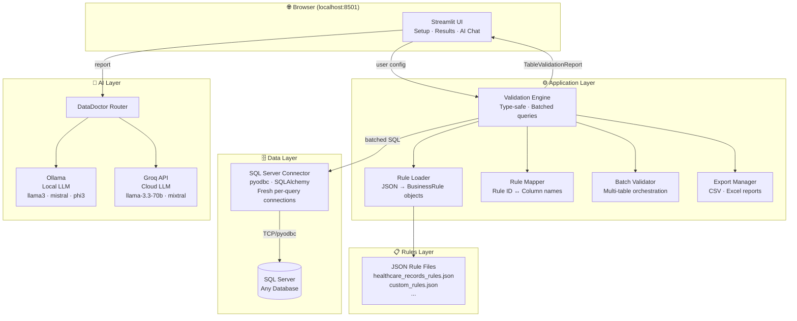

<div align="center">

<br/>

```
██████╗  █████╗ ████████╗ █████╗ ██████╗  ██████╗  ██████╗████████╗ ██████╗ ██████╗
██╔══██╗██╔══██╗╚══██╔══╝██╔══██╗██╔══██╗██╔═══██╗██╔════╝╚══██╔══╝██╔═══██╗██╔══██╗
██║  ██║███████║   ██║   ███████║██║  ██║██║   ██║██║        ██║   ██║   ██║██████╔╝
██║  ██║██╔══██║   ██║   ██╔══██║██║  ██║██║   ██║██║        ██║   ██║   ██║██╔══██╗
██████╔╝██║  ██║   ██║   ██║  ██║██████╔╝╚██████╔╝╚██████╗   ██║   ╚██████╔╝██║  ██║
╚═════╝ ╚═╝  ╚═╝   ╚═╝   ╚═╝  ╚═╝╚═════╝  ╚═════╝  ╚═════╝   ╚═╝    ╚═════╝ ╚═╝  ╚═╝
```

### **AI-Powered Data Quality Validation**
*Connect any database · Define rules in JSON · Get instant AI diagnosis*

<br/>

[](https://python.org)
[](https://streamlit.io)
[](https://docker.com)
[](https://microsoft.com/sql-server)
[](LICENSE)

<br/>

[🚀 Live Demo](#-live-demo) · [⚡ Quick Start](#-quick-start) · [📋 Rules Guide](#-writing-validation-rules) · [🗺️ Roadmap](#️-roadmap)

<br/>

</div>

---

## 🩺 What is DataDoctor?

**DataDoctor** is an open-source, AI-powered data quality platform that lets you validate any SQL Server database against custom business rules — all defined in simple JSON files, no coding required.

Point it at your database, map your rules to columns, and get:
- **Instant validation** with failure counts, percentages, and drill-down samples
- **AI diagnosis** that conversationally explains what's wrong and why it matters 
- **Exportable reports** in CSV and Excel with colour-coded severity

> **The core idea:** Your data team writes the rules. DataDoctor enforces them — and explains every failure in plain conversational English.

---

## ✨ Features

| Feature | Description |
|---------|-------------|
| 🔌 **Universal DB Connection** | Connect to any SQL Server database with Windows or SQL Authentication |
| 📋 **JSON-Defined Rules** | Write validation rules in JSON — no Python, no SQL, no code |
| 🔒 **Type-Safe Validation** | Rules are matched to compatible column types automatically — no false positives from type mismatches |
| 🤖 **AI Diagnosis** | DataDoctor AI (powered by Ollama or Groq) analyses your results and recommends fixes |
| 📊 **Rich Visualisations** | Severity breakdown, top failing columns, rule-type charts — all interactive |
| 🔍 **Drill-Down Sampling** | See up to 100 actual failing rows per rule — not just counts |
| 📥 **Export Reports** | Download full validation reports as CSV or colour-coded Excel |
| 🔄 **Batch Validation** | Validate multiple tables in one run |
| 🐳 **Docker Ready** | One command to run anywhere |

---

## 🏗️ Architecture



---

## 🛠️ Tech Stack

| Layer | Technology | Purpose |
|-------|-----------|---------|
| **UI** | Streamlit 1.39 | Interactive web interface |
| **Validation** | Python 3.11 | Rule engine, type checking, batched SQL |
| **Database** | SQLAlchemy 2.0 + pyodbc | SQL Server connectivity |
| **AI (Local)** | Ollama | Run LLMs locally — fully private |
| **AI (Cloud)** | Groq API | Ultra-fast cloud inference, free tier |
| **Visualisation** | Plotly 5.18 | Interactive charts |
| **Data** | Pandas 2.1 + DuckDB 0.9 | Data handling and analytics |
| **Export** | openpyxl 3.1 | Colour-coded Excel reports |
| **Container** | Docker + ODBC Driver 17 | Portable deployment |

---

## 🚀 Quick Start

### Option A — Local (Python)

**Prerequisites:** Python 3.11+, SQL Server, ODBC Driver 17

```bash
# 1. Clone the repo
git clone https://github.com/yourusername/db-data-validator.git
cd db-data-validator

# 2. Create and activate virtual environment
python -m venv venv
source venv/bin/activate        # Mac/Linux
venv\Scripts\activate           # Windows

# 3. Install dependencies
pip install -r requirements.txt

# 4. Configure environment
cp .env.example .env
# Edit .env with your settings (see Configuration section)

# 5. Run
streamlit run main.py
```

Open **http://localhost:8501** → connect your database → start validating.

---

### Option B — Docker (Recommended)

**Prerequisites:** Docker Desktop

```bash
# 1. Clone
git clone https://github.com/yourusername/db-data-validator.git
cd db-data-validator

# 2. Configure
cp .env.example .env

# 3. Build and run
docker compose up --build
```

Open **http://localhost:8501**

> **Connecting from Docker to a local SQL Server:**
> Use `host.docker.internal,1434` as the server name (not `localhost`).
> SQL Authentication is required — Windows Auth is unavailable from Linux containers.

---

### Configuration (`.env`)

```env
# AI Backend (choose one or both)
GROQ_API_KEY=your_groq_api_key_here
OLLAMA_API_URL=http://localhost:11434    # local; use host.docker.internal in Docker
OLLAMA_MODEL=llama3

# LLM Provider default
LLM_PROVIDER=ollama    # or: groq
```

---

## 📋 Writing Validation Rules

Rules are plain JSON. No Python. No SQL knowledge required for business users.

### Rule Anatomy

```json
{
  "rule_id": "HC_007",
  "rule_name": "Blood Type Valid",
  "column_type": "string",
  "rule_description": "Blood type must be a valid ABO/Rh value",
  "validation_logic": "[COLUMN] IS NULL OR [COLUMN] IN ('A+','A-','B+','B-','AB+','AB-','O+','O-')",
  "severity": "WARNING"
}
```

| Field | Description |
|-------|-------------|
| `rule_id` | Unique identifier (e.g. `HC_007`) |
| `column_type` | `string`, `numeric`, or `date` — engine skips incompatible columns automatically |
| `validation_logic` | SQL expression using `[COLUMN]` as placeholder — rows where this is FALSE are failures |
| `severity` | `CRITICAL`, `WARNING`, or `INFO` |

### Severity Levels

| Level | Meaning | Colour |
|-------|---------|--------|
| `CRITICAL` | Data is unusable — must fix | 🔴 Red |
| `WARNING` | Data quality concern — should fix | 🟡 Amber |
| `INFO` | Informational — worth reviewing | 🔵 Blue |

### Full Rule Set Example

```json
{
  "rule_set_name": "Healthcare Patient Records",
  "version": "1.1",
  "rules": [
    {
      "rule_id": "HC_001",
      "rule_name": "Patient Name Not Blank",
      "column_type": "string",
      "rule_description": "Patient name must not be NULL or empty",
      "validation_logic": "[COLUMN] IS NOT NULL AND LTRIM(RTRIM([COLUMN])) <> ''",
      "severity": "CRITICAL"
    },
    {
      "rule_id": "HC_002",
      "rule_name": "Patient Name Proper Case",
      "column_type": "string",
      "rule_description": "Detect irregular mixed case names (e.g. 'Bobby JacksOn')",
      "validation_logic": "[COLUMN] IS NULL OR (PATINDEX('%[a-z][A-Z]%', [COLUMN] COLLATE Latin1_General_CS_AS) = 0 AND PATINDEX('% [a-z]%', [COLUMN] COLLATE Latin1_General_CS_AS) = 0)",
      "severity": "WARNING"
    },
    {
      "rule_id": "HC_010",
      "rule_name": "Admission Date Not Future",
      "column_type": "date",
      "rule_description": "Admission date cannot be in the future",
      "validation_logic": "[COLUMN] IS NULL OR [COLUMN] <= CAST(GETDATE() AS DATE)",
      "severity": "CRITICAL"
    }
  ]
}
```

Save your rule file to `rules/configs/` and it instantly appears in the app dropdown.

---

## 🤖 DataDoctor AI

DataDoctor includes a conversational AI layer that analyses your validation results and answers follow-up questions.

### Supported Backends

| Backend | Best For | Setup |
|---------|----------|-------|
| **Ollama** (local) | Privacy-sensitive data, offline use | `ollama pull llama3` |
| **Groq** (cloud) | Speed, demos, free tier | Add `GROQ_API_KEY` to `.env` |

### What It Does

- Summarises validation findings in plain English
- Prioritises which issues to fix first
- Explains the business impact of each failure type
- Answers follow-up questions about specific columns or rules
- Suggests SQL fixes for common issues

---

## 📁 Project Structure

```
db-data-validator/
├── main.py                          # Streamlit entry point
├── config.py                        # App configuration
├── requirements.txt
├── Dockerfile
├── docker-compose.yml
├── .dockerignore
│
├── app/
│   └── db_connector.py              # SQL Server connection manager
│
├── validators/
│   ├── validation_engine.py         # Core validation orchestrator
│   ├── batch_validator.py           # Multi-table validation
│   ├── rule_mapper.py               # Rule ↔ column mapping
│   ├── export_manager.py            # CSV + Excel export
│   ├── standard_rules.py            # Built-in null/blank checks
│   └── data_doctor_router.py        # AI backend router (Ollama/Groq)
│
├── rules/
│   ├── business_rules.py            # BusinessRule dataclass + engine
│   ├── rule_loader.py               # JSON → BusinessRule loader
│   └── configs/                     # ← DROP YOUR RULE FILES HERE
│       ├── healthcare_records_rules.json
│       ├── sample_string_rules.json
│       ├── sample_numeric_rules.json
│       └── sample_date_rules.json
│
└── utils/
    └── models.py                    # Shared data models
```

---

## 🗺️ Roadmap

### ✅ Completed

- [x] SQL Server connectivity (Windows Auth + SQL Auth)
- [x] JSON rule engine with type-safe validation
- [x] DataDoctor AI (Ollama + Groq)
- [x] Interactive dashboards (Plotly)
- [x] CSV + Excel export
- [x] Batch validation (multi-table)
- [x] Docker containerisation
- [x] Healthcare demo dataset (55,500 rows)

### 🔜 Future Development: Phase 1 — Multi-Database Support

- [ ] **PostgreSQL** support
- [ ] **MySQL / MariaDB** support
- [ ] **Snowflake** connector
- [ ] **BigQuery** connector
- [ ] **SQLite** for local/lightweight use
- [ ] Auto-detect database dialect for validation SQL

### 🔮 Future Development: Phase 2 — Intelligence Layer

- [ ] **Auto-rule generation** — AI suggests rules from schema analysis
- [ ] **Anomaly detection** — statistical outlier flagging without manual rules
- [ ] **Rule versioning** — track rule changes over time
- [ ] **Scheduled validation** — run validations on a cron schedule
- [ ] **Alerting** — email/Slack notifications on critical failures

### 🌐 Future Development: Phase 3 — Enterprise

- [ ] **Multi-user support** — role-based access
- [ ] **Audit trail** — full history of validations
- [ ] **REST API** — trigger validations programmatically
- [ ] **dbt integration** — validate dbt models post-run
- [ ] **Lineage tracking** — trace data quality issues to source

---

## 🤝 Contributing

Contributions are welcome — especially rule sets for new domains.

```bash
# Fork and clone
git clone https://github.com/yourusername/db-data-validator.git

# Create a branch
git checkout -b feature/postgres-connector

# Make your changes, then open a Pull Request
```

**Easy contributions:**
- 📋 Add a new JSON rule set for your domain (finance, e-commerce, healthcare)
- 🐛 Report bugs via Issues
- 📖 Improve documentation

---

## 📄 License

MIT License — free to use, modify, and distribute. See [LICENSE](LICENSE) for details.

---

<div align="center">

**Built with 🩺 and Python**

*DataDoctor — because bad data is a diagnosis, not a destiny.*

</div>
